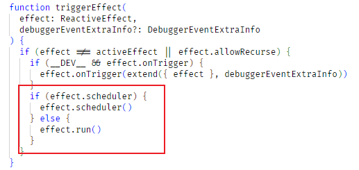

> Vue3的第一个版本在2019年12月20日发布（版本号为3.0.0-alpha.0），如今已过去2年半的时间了。这段时间Vue成长得很快，除了及时响应GitHub上提的各种issue之外，本身也在不断地完善功能。在上家公司，我们使用Vue3重构了Vue2的项目。最近一段时间闲着没事，便看了下Vue3的核心模块——`reactivity`的源码。以下是看源码的一些心得：


① Vue2 和 Vue3 用到的响应式原理不同
Vue2只用到了一种技术，即Object.defineProperty，而Vue3用到了2种，包含了getter/setter和Proxy（使用Proxy也代表着Vue3彻底放弃了IE11，这个可以从Vue官方的rfc里得到证实 —— [Proposal for dropping ie11 support in Vue 3](https://github.com/vuejs/rfcs/discussions/296)）。
使用Proxy替代Object.defineProperty的好处显而易见：
1. 它可以拦截对象上几乎所有的操作，而Vue2的Object.defineProperty对于一些操作是无法拦截的。比如在对象上新增一个属性，或者直接通过数组下标设置值，如`vm.items[indexOfItem] = newValue`以及更改数组的length属性：`vm.items.length = newLength`，因此需要使用Vue2特殊的`vm.$set`方法
2. Proxy的性能比Object.defineProperty好很多（特别是对于大的对象和数组）
3. Vue3创建Proxy的方式是惰性的。当新建一个响应式数据时，Vue只会对这个对象最外层属性创建代理，对于深层的属性，Vue一开始不会为其创建对应的Proxy，只有当这个深层属性被读取时才会有Proxy为其生成。反观Vue2，无论提供的state对象多大、嵌套多深，Vue2都需要在一开始对其进行遍历，为每个属性定义getter和setter。

② Vue3支持对原生类型的值（primitive value）进行代理，而Vue2只能对对象进行代理
Vue3支持原生类型值的代理是通过`RefImpl`这个类的getter/setter实现的。代码如下


将getter/setter设置在Class上的好处是：每当Vue新建一个ref实例，我们不需要为每个实例分配一个value的getter/setter函数，因为这两个函数位于RefImpl的原型上。这样子可以达到节省Vue运行内存的目的
_ _ _
**接下来我们来看Vue是如何运用这些响应式数据的吧**
我们首先要介绍一个类：`ReactiveEffect`，它的作用就是收集（通过deps这个属性）各个依赖（依赖指的是通过`reactive`和`ref`创建的响应式数据），并在这些依赖发生变化时触发相应的更新 —— `scheduler`。Vue的`render`函数实现原理也与ReactiveEffect有关。


以下为Dep的类型定义：


这里可能有人会好奇依赖是怎么收集的呢？这就要介绍到我们的getter和proxy的 get handler了
1. ref的getter函数


2. proxy的 get handler


当我们获取`ref.value`或`reactive`对象上的某个属性时，我们就会触发相应的getter，执行`trackRefValue(this)`和`track(target, TrackOpTypes.GET, key)`，这两个函数最终均会调用`trackEffects()`。以下为`trackEffects`的具体实现：


我们注意到，当这个依赖需要被跟踪时，Vue首先会将当前ReactiveEffect（也就是activeEffect）添加进Dep集合中，而ReactiveEffect也会同时将这个依赖加入自身的deps数组中
```javascript
deps.add(activeEffect!)
activeEffect!.deps.push(dep)
```
由此可见依赖（Dep）和 ReactiveEffect 之间是双向绑定关系。
- - -
看完了如何收集依赖，接下来看一下当依赖更新时Vue是如何处理的吧
1. ref的setter函数


2. proxy的set handler


当某个响应式数据的值变化时，相应的setter便会触发，紧接着调用`triggerRefValue(this, newVal)`和`trigger(target, TriggerOpTypes.ADD, key, value`，这两个函数最终会调用`triggerEffects()`



触发更新的时候，首先会判断当前effect有没有scheduler（我们实例化ReactiveEffect时传的第二个参数），有就调用，没有则执行`effect.run()`
* * *
#### watchEffect vs watch
> 在使用Vue3的Composition api过程中，很多人会疑惑这两个api的区别在哪里，这里我们就简单地说一下

首先，watchEffect的函数签名和watch的函数签名就存在不同


我们注意到，`watchEffect`最多接受两个有效参数，而watch最多可以接受到三个有效参数。`watch`比`watchEffect`多接收的参数正是`WatchSource`。也就是`watch`监听的数据源
这两个api的相同之处在于它们内部均是调用`doWatch`方法

除了函数接收的参数数量上的明显差异外，watch和watchEffect的另一个明显差异是watchEffect会在它执行时立马调用我们的回调函数（这是为了收集依赖）；而watch除非在你给它指定了immediate:true，否则默认情况下，watch的回调函数只有在监听的数据源发生变化时才会执行
* * *
#### Watch API 使用注意事项
Vue 的 watch API使用起来有很多需要注意的地方，以下是自己看源码以及实践得出来的一些经验：
1. **当我们watch的数据是一个ref的时候：**

1.1 如果ref里传的是一个primitive类型值，如number, boolean, string等，我们可以直接这样写：
```javascript
const num = ref(1)
watch(num, (value, oldValue) => console.log(value, oldValue));
```

1.2 如果我们往ref里传入的值是对象类型，如数组或js对象时，我们必须这样写：
```javascript
const arr = ref([1,2,3]);
watch(() => structuredClone(arr), (newArr, oldArr) => console.log(newArr, oldArr));
```
```javascript
const obj = ref({foo: {bar: 'baz'}})
watch(() => structuredClone(obj), (newObj, oldObj) => console.log(newObj, oldObj));
```
2. **当我们watch的数据是reactive构建出来的对象时：**
```javascript
const obj = reactive({foo: {bar: 'baz'}})；
watch(() => structuredClone(obj), (newObj, oldObj) => console.log(newObj, oldObj))
```

有人可能会说，自己平时看到别人写的代码和上面的不同，他们一般是这样写的： 
```javascript
// ref + 数组
const arr = ref([1,2,3]);
watch(() => [...arr], (newArr, oldArr) => console.log(newArr, oldArr));
```

```javascript
// ref + 对象
const obj = ref({foo: {bar: 'baz'}})
watch(() => ({...obj}), (newObj, oldObj) => console.log(newObj, oldObj));
```

```javascript
// reactive + 对象
const obj = reactive({foo: {bar: 'baz'}})；
watch(() => ({...obj}), (newObj, oldObj) => console.log(newObj, oldObj))
```

**接下来我们来总结这两种写法的不同之处吧**
这两种写法最本质的不同在于：`structuredClone`是深拷贝，而展开运算符是浅拷贝。
说到structuredClone，它是一个比较新的API，采用的拷贝算法叫**== structured clone algorithm ==**。mdn上有详细描述：[https://developer.mozilla.org/en-US/docs/Web/API/Web_Workers_API/Structured_clone_algorithm](https://developer.mozilla.org/en-US/docs/Web/API/Web_Workers_API/Structured_clone_algorithm)。该API目前的兼容性如下(达到75.88%)。对于不支持的浏览器，我们可以使用polyfill，[core-js](https://github.com/zloirock/core-js#structuredclone) 和这个github仓库均有提供：[https://github.com/ungap/structured-clone](https://github.com/ungap/structured-clone)


深拷贝与浅拷贝就是这两种写法最本质的不同。当我们的ref或reactive指向的是一个带有深层嵌套关系的对象时（如`{foo: {bar: 'baz'}}`或`[{a:1}]`），使用浅拷贝会让watch回调里的newValue和oldValue拿到同一个引用，无法展现出前后的区别；如果想看到前后的变化，我们就必须使用深拷贝了。

_ _ _
其实在JS中使用深拷贝最常见的方式是`JSON.parse(JSON.Stringify())`，但这种方式存在诸多问题，一些场景下并不适用
如果既不想使用JSON.parse，也不想使用structruedClone的话，我们还可以借助`lodash`的`cloneDeep`方法
* * *
#### watch 的 flush 时机
> 可参考资料：[https://vuejs.org/guide/essentials/watchers.html#callback-flush-timing](https://vuejs.org/guide/essentials/watchers.html#callback-flush-timing)

watch 的 flush 时机分为三类，分别为`pre`，`post`和`sync`：


这三个指的什么意思？`pre`代表前，`post`代表后，而`sync`代表同步。在Vue中，`watch`的副作用（也就是回调函数）默认情况下是异步执行的（`pre`）。这样做的好处在于它可以帮我们排除掉一些重复的副作用 —— 我们知道`watch`的数据源可以有多个，当我们连续对数据源进行多次操作的时候，就会多次触发副作用。通过异步的方式我们就可以排除掉重复的副作用，这样可以达到更好的性能，也更符合功能的预期。如果你并不希望这种默认行为，可以给`watch`加上`flush:sync`选项。

在Vue中主要存在三个异步任务队列，分别是`queue`（存放与组件更新——`render`相关的副作用）、`pendingPreFlushCbs`/`activePreFlushCbs`（存放需要在render执行前执行的副作用）和`pendingPostFlushCbs`/`activePostFlushCbs`（存放需要在render执行后执行的副作用）。

`flush`选项的`pre`和`post`就分别对应第二个和第三个队列


那`sync`是什么意思呢？`sync`中文翻译为`同步`。这从字面意思上就很好理解了，因为我们之前提到了watch的副作用一般都是异步执行的，但如果我们不想它异步执行呢？这时候就需要在`watch`api上指定`flush`为`sync`了。这样当watch的DataSource发生变化时，会立刻执行相应的副作用


